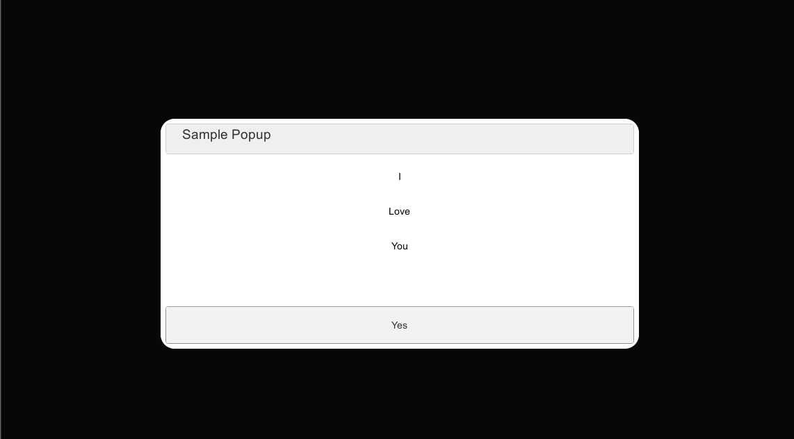

# PopupSDK Sample Unity
 
 
## Overview

The PopupSDK for Unity demo you how to show an popup in Unity. And config UI for it.
 


* Mutil button popup
* Mutil UI(Dark/Light/None)
* Config yourself popup
* ...
 


__NOTICE__: This version of popup was develop to show you as a demo. And refer many resource to create. Show It's sample for Unity. We could custom it later
 
 

Features:

* Config UI
* Config Type Popup(Mutil/Single/Double)

 

## Upgrading

If you have already integrated your project with a previous version of the
plugin and wish to upgrade to a new version, please give a start =) 

## Configure Your Game

To use the plugin, import package to see sample. Or open solution lib popupsdk. And bat file. Config your path to Unity project folder want set dll output.

 

### More config feature

 

### More

 

## Setup  

Make sure to do the following if they are relevant to your game:

 

 
## Code Configuration & Initialization   

 
```csharp
    //Init
     public static PopupManager Instance
        {
             get => _instance == null ? _instance = GameObject.FindObjectOfType<PopupManager>() : _instance;
        }
```

 ```csharp
    //Show
      public void ShowPopup(string textShowTitle, Action confirmbutton)
        {
            foreach (PopupContentUI item in listContentPopup)
            {
                item.CreateButtonInsidePopup();
            }
            UIPopup.SetTitleText(textShowTitle);
            UIPopup.ConfirmButtonClick(confirmbutton);
        }
```


## Adding additional:

 
  __Note: adding additional scopes with most likely require user consent when
starting your game__.

## Result:

 

